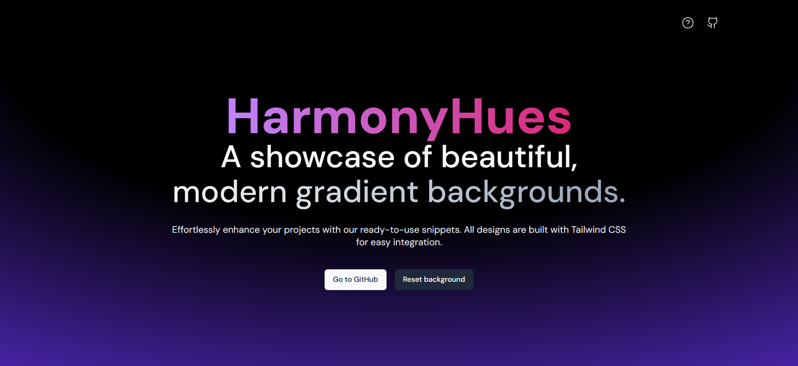

# Harmony Hues

[Live Demo](https://harmonyhues-eight.vercel.app/)

## Description

HarmonyHues is a curated collection of beautiful, modern gradient backgrounds, crafted using Tailwind CSS. Each gradient is designed to seamlessly integrate with your web projects. Perfect for developers and designers looking to add a touch of elegance and creativity to their work.



## How to Use

1. **Preview the Background:**
   - Click on the "Preview" button. This will show you what the gradient background looks like.
2. **Get the Gradient Code:**
   - Click on the "Copy Code" button. This will copy the code for the gradient to your clipboard.
3. **Apply the Code to Your Web App:**

```html
<div
  class="absolute top-0 z-[-2] h-screen w-screen rotate-180 transform bg-white bg-[radial-gradient(60%_120%_at_50%_50%,hsla(0,0%,100%,0)_0,rgba(252,205,238,.5)_100%)]"
></div>
```

**Note:** The exact code you get when you click "Copy Code" might look different depending on the gradient.
